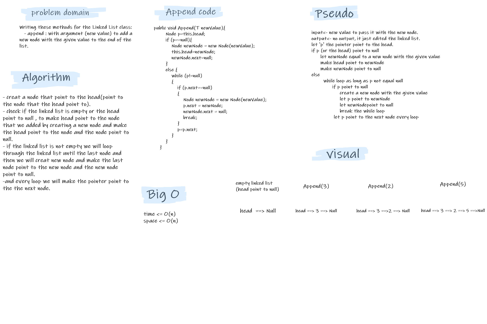

# Challenge Summary

- Writing these methods for the Linked List class:
   1. append : with argument **new value** to add a new node with the given value to the end of the list.
   2. insert before : with arguments (value, new value) to add a new node with the given new value immediately before the first node that has the value specified.  
   3. insert after : with arguments (value, new value)to add a new node with the given new value immediately after the first node that has the value specified.  
   

## Whiteboard Process

  
  

## Approach & Efficiency

- Append : loop through the linked list until the last node and then add the new node, the big O for this method is O(n).  
- InsertBefore : loop through the linked list until we find the value that we will add the new node before it, the big O is O(n). but if the vale in the first node the big O will be O(1).  
- InsertAfter : loop through the linked list until we find the value that we will add the new node After it, the big O is O(n).  

## Solution

- we will write a tests for every method and check the equality of the expected output and the actual output.
- Example: to append a node at the last with value (5):  
     the original linked list: head -> [1] -> [3] -> [2] -> Null  
     the expected linked list: head -> [1] -> [3] -> [2] -> [5] -> Null  
     the actual linked list: head -> [1] -> [3] -> [2] -> [5] -> Null  

