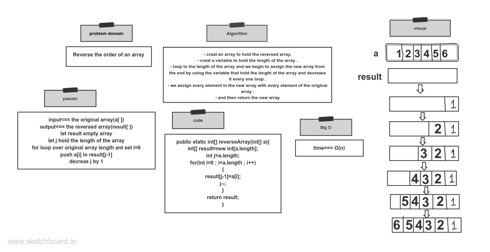

# Reverse an Array
Write a function called reverseArray which takes an array as an argument. Without utilizing any of the built-in methods available to your language, return an array with elements in reversed order.

## Whiteboard Process
 

## Approach & Efficiency
- creat an array to hold the reversed array.
- creat a variable to hold the length of the array .
- loop to the length of the array and we begin to assign the new array from
  the end by using the variable that hold the length of the array and decrease
  it every one loop .
- we assign every element in the new array with every element of the original
  array .
- and then return the new array
- the big O of this problem is O(n)