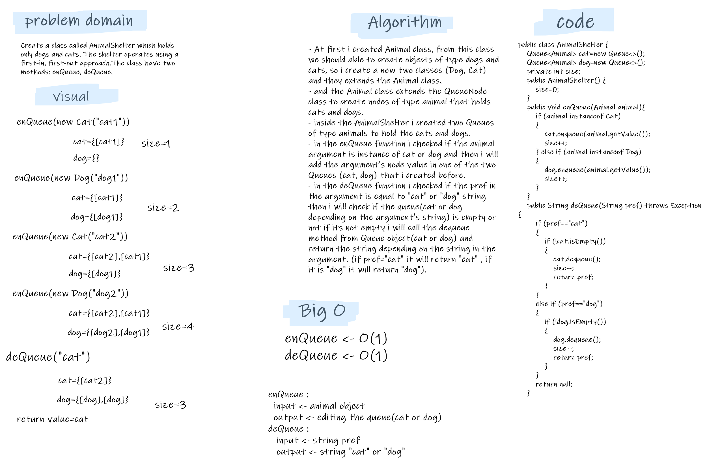

# Challenge Summary

- Create a class called AnimalShelter which holds only dogs and cats.  
- The shelter operates using a first-in, first-out approach.  
- Implement the following methods:  
   - enqueue  
            Arguments: animal  
                animal can be either a dog or a cat object.  
   - dequeue  
       Arguments: pref  
           pref can be either "dog" or "cat"  
       Return: either a dog or a cat, based on preference.
           If pref is not "dog" or "cat" then return null.


## Whiteboard Process


## Approach & Efficiency
- At first i created Animal class, from this class we should be able to create objects of type dogs and cats, so i create a new two classes (Dog, Cat) and they extends the Animal class.  
- and the Animal class extends the QueueNode class to create nodes of type animal that holds cats and dogs.  
- inside the AnimalShelter i created two Queues of type animals to hold the cats and dogs.  
- and inside the enqueue function i just invoked the enqueue method from cat or dog object.(so the big O is --> O(1)).   
- and inside the dequeue function i just invoked the dequeue method from cat or dog object. (so the big O is --> O(1)).

## Solution
- tested my code using the unit tests to check if my expected output equal to the actual output. you can run the appTest to check if all the Tests are passed successfully.  
   ```
  @Test void animalShelterTest() throws Exception {
        AnimalShelter animal=new AnimalShelter();
        animal.enQueue(new Cat("cat1"));
        animal.enQueue(new Dog("dog1"));
        animal.enQueue(new Cat("cat2"));
        animal.enQueue(new Dog("dog2"));
        animal.enQueue(new Cat("cat3"));

        assertEquals("cat1",animal.deQueue("cat"));
    }
  ```
- for Empty queue:
   ```
  @Test void animalShelterEmptyTest() throws Exception {
        AnimalShelter animal=new AnimalShelter();
        animal.enQueue(new Dog("dog1"));
        animal.enQueue(new Dog("dog2"));

        assertNull(animal.deQueue("cat"));
    }
  ```