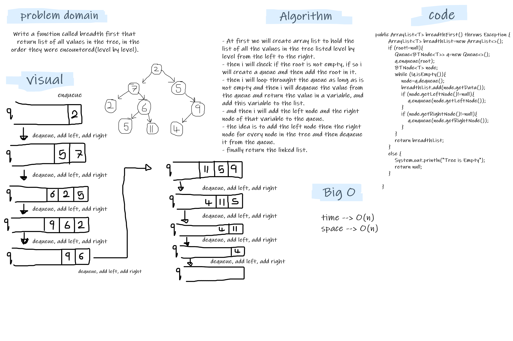

# Challenge Summary
Write a function called breadth first that
return list of all values in the tree, in the order they were encountered(level by level) from left to right.

## Whiteboard Process


## Approach & Efficiency
- i used a queue and add the root to it, and then enqueue the left then right node to it an then add the left and the right of the left node and then for the right node and so on. by while loop through the queue and enqueue the left and the right for every node in the queue.
- the big O is O(n) for both space and time.

## Solution
- tested my code using the unit tests to check if my expected output equal to the actual output. you can run the appTest to check if all the Tests are passed successfully.
   ```
  @Test void breadthFirstTest() throws Exception {
        BinarySearchTree<Integer> newTree=new BinarySearchTree<>();
        newTree.add(5);
        newTree.add(8);
        newTree.add(4);
        newTree.add(3);
        newTree.add(4);
        newTree.add(90);
        newTree.add(55);
        assertEquals("[5, 4, 8, 3, 90, 55]",newTree.breadthFirst().toString());
    }
  ```

