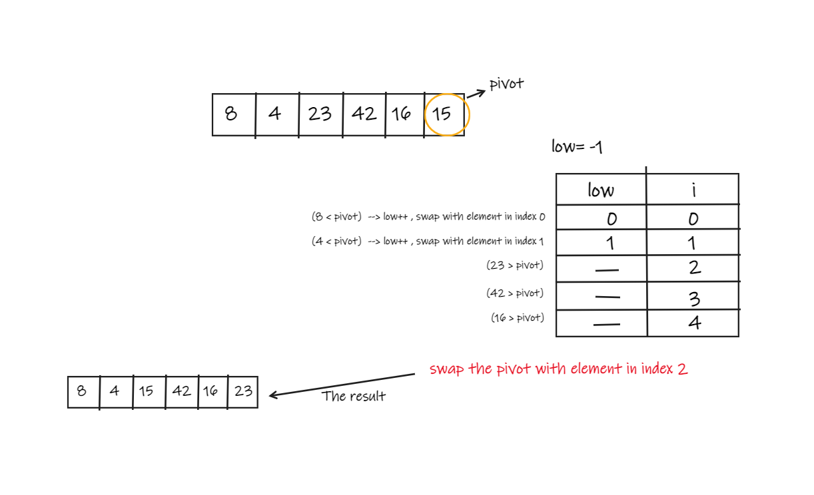

# Quick Sort  

Quick sort is a sorting algorithm uses divide and conquer approach, the array is divided into sub-arrays by selecting a pivot element (element selected from the array).  
The left and right sub-arrays are also divided using the same approach. This process continues until each sub-array contains a single element. At this point, elements are already sorted. Finally, elements are combined to form a sorted array.  

## Pseudocode  

  ```
ALGORITHM QuickSort(arr, left, right)
    if left < right
        // Partition the array by setting the position of the pivot value
        DEFINE position <-- Partition(arr, left, right)
        // Sort the left
        QuickSort(arr, left, position - 1)
        // Sort the right
        QuickSort(arr, position + 1, right)

ALGORITHM Partition(arr, left, right)
    // set a pivot value as a point of reference
    DEFINE pivot <-- arr[right]
    // create a variable to track the largest index of numbers lower than the defined pivot
    DEFINE low <-- left - 1
    for i <- left to right do
        if arr[i] <= pivot
            low++
            Swap(arr, i, low)

     // place the value of the pivot location in the middle.
     // all numbers smaller than the pivot are on the left, larger on the right.
     Swap(arr, right, low + 1)
    // return the pivot index point
     return low + 1

ALGORITHM Swap(arr, i, low)
    DEFINE temp;
    temp <-- arr[i]
    arr[i] <-- arr[low]
    arr[low] <-- temp

```
## Trace  
- **Sample Array: [8,4,23,42,16,15]**  

### Trace 1 --> Partition
  

### Trace 2  --> sort the left side 
  

### Trace 3 --> sort the right side


### The final result  
  

## Efficiency  

- Time in the worst case --> O(n^2)  
   - It occurs when the pivot element picked is either the greatest or the smallest element.  
- space --> O(logn)