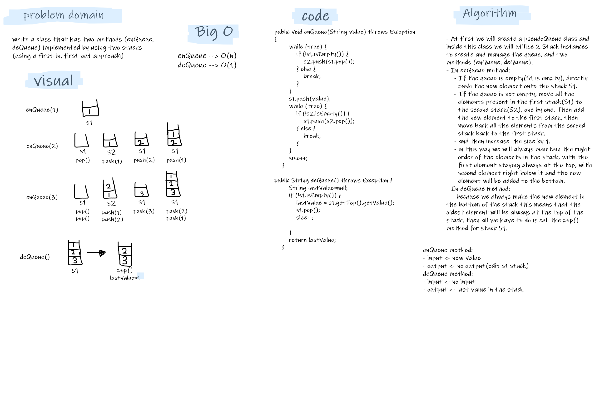

# Challenge Summary
write a class that has two methods (enQueue, deQueue) implemented by using two stacks (using a first-in, first-out approach)

## Whiteboard Process

## Approach & Efficiency
- enQueue : always maintain the right order of the elements in the stack, with the first element staying always at the top, with second element right below it and the new element will be added to the bottom.  
- deQueue : just return and remove the last element in the stack by call the pop() method for first stack.

## Solution
- tested my code using the unit tests to check if my expected output equal to the actual output. you can run the appTest to check if all the Tests are passed successfully.
   > @Test void pseudoQueueTest() throws Exception {  
     pseudoQueue newQueue=new pseudoQueue();  
     newQueue.enQueue("1");  
     newQueue.enQueue("2");  
     newQueue.enQueue("3");  
     newQueue.enQueue("4");  
     assertEquals("1",newQueue.getS1().getTop().getValue());   
  > }  

