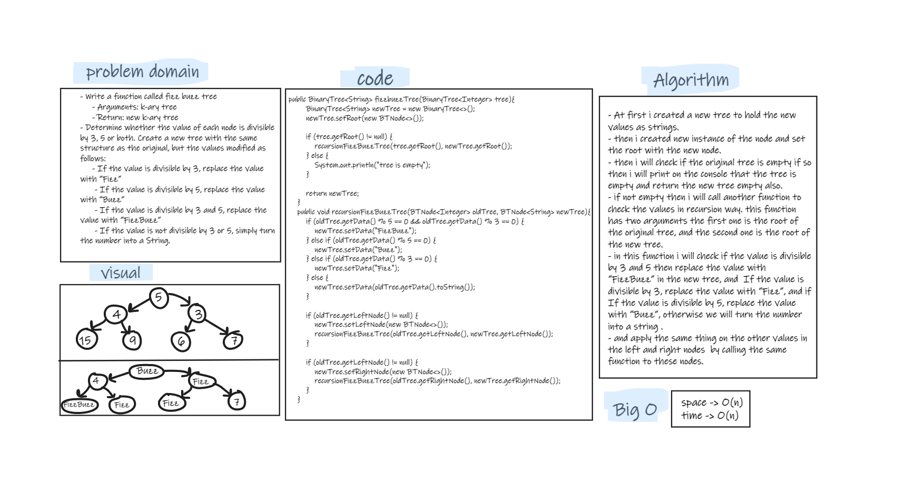

# Challenge Summary
- Write a function called fizz buzz tree
   - Arguments: k-ary tree
   - Return: new k-ary tree
- Determine whether the value of each node is divisible by 3, 5 or both. Create a new tree with the same structure as the original, but the values modified as follows:  
    - If the value is divisible by 3, replace the value with “Fizz”
    - If the value is divisible by 5, replace the value with “Buzz”
    - If the value is divisible by 3 and 5, replace the value with “FizzBuzz”
    - If the value is not divisible by 3 or 5, simply turn the number into a String.


## Whiteboard Process


## Approach & Efficiency
- i used two methods to solve this challenge the first one to check if the tree is null or not and call the second method to check all the values in the tree in recursion way.  
- the big O is -> O(n) for both space and time.

## Solution
- tested my code using the unit tests to check if my expected output equal to the actual output. you can run the appTest to check if all the Tests are passed successfully.  
   ```
  @Test void fizzbuzzTest(){
        BinaryTree<Integer> fizzbuzz=new BinaryTree<>();
        fizzbuzz.setRoot(new BTNode<>(5));
        fizzbuzz.getRoot().setLeftNode(new BTNode<>(4));
        fizzbuzz.getRoot().setRightNode(new BTNode<>(3));
        fizzbuzz.getRoot().getLeftNode().setLeftNode(new BTNode<>(15));
        fizzbuzz.getRoot().getLeftNode().setRightNode(new BTNode<>(9));
        fizzbuzz.getRoot().getRightNode().setLeftNode(new BTNode<>(6));
        fizzbuzz.getRoot().getRightNode().setRightNode(new BTNode<>(7));
        System.out.println(fizzbuzz.fizzbuzzTree(fizzbuzz));
        assertEquals("Buzz",fizzbuzz.fizzbuzzTree(fizzbuzz).getRoot().getData());
    }
  ```
  ```
  @Test void fizzbuzzLeftNodeTest(){
        BinaryTree<Integer> fizzbuzz=new BinaryTree<>();
        fizzbuzz.setRoot(new BTNode<>(5));
        fizzbuzz.getRoot().setLeftNode(new BTNode<>(4));
        fizzbuzz.getRoot().setRightNode(new BTNode<>(3));
        fizzbuzz.getRoot().getLeftNode().setLeftNode(new BTNode<>(15));
        fizzbuzz.getRoot().getLeftNode().setRightNode(new BTNode<>(9));
        fizzbuzz.getRoot().getRightNode().setLeftNode(new BTNode<>(6));
        fizzbuzz.getRoot().getRightNode().setRightNode(new BTNode<>(7));
        System.out.println(fizzbuzz.fizzbuzzTree(fizzbuzz));
        assertEquals("4",fizzbuzz.fizzbuzzTree(fizzbuzz).getRoot().getLeftNode().getData());
    }
  ```
- for empty tree:
   ```
  @Test void fizzbuzzNullTest(){
        BinaryTree<Integer> fizzbuzz=new BinaryTree<>();

        System.out.println(fizzbuzz.fizzbuzzTree(fizzbuzz));
        assertNull(fizzbuzz.fizzbuzzTree(fizzbuzz).getRoot().getData());
    }
  ```
  
