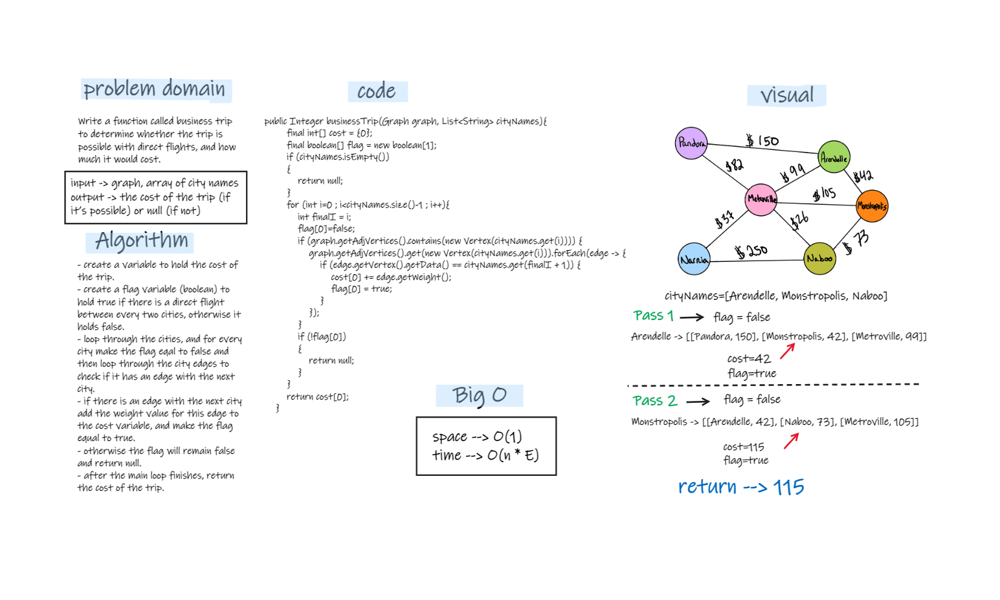

# Challenge Summary
- Write a function called business trip to determine whether the trip is possible with direct flights, and how much it would cost.  
- inputs : graph, array of city names.  
- output : the cost of the trip (if it’s possible) or null (if not).

## Whiteboard Process


## Approach & Efficiency
- looping through the city list and check every two cities, if the second city have an edge with the first city. if its have an edge we will add the weight of the edge to the total cost of the trip. but if there is no edge between any two cities of the city list then we will return null because it will be a trip with not direct flights.  
- space complexity : O(1)  -> all the additional spaces are O(1)
- time complexity : O(n * E) -> I think that the time complexity for the time is O(n * E) because we have a for loop for the city names, and another forEach loop inside the first for loop to loop through the edges of every city element.

## Solution
- testing my code using the unit tests to check if my expected output equal to the actual output. you can run the appTest to check if all the Tests are passed successfully.  
- Also by tracing the code on an array. (like in the whiteboard)  

   ```
  @Test void businessTripTest(){
        BusinessTrip businessTrip=new BusinessTrip();
        Graph graph2=new Graph();
        graph2.addVertex("Pandora");
        graph2.addVertex("Arendelle");
        graph2.addVertex("Metroville");
        graph2.addVertex("Monstropolis");
        graph2.addVertex("Narnia");
        graph2.addVertex("Naboo");

        graph2.addEdges("Pandora","Arendelle",150);
        graph2.addEdges("Pandora","Metroville",82);
        graph2.addEdges("Arendelle","Metroville",99);
        graph2.addEdges("Arendelle","Monstropolis",42);
        graph2.addEdges("Metroville","Monstropolis",105);
        graph2.addEdges("Naboo","Monstropolis",73);
        graph2.addEdges("Naboo","Metroville",26);
        graph2.addEdges("Naboo","Narnia",250);
        graph2.addEdges("Metroville","Narnia",37);
        List<String> cityNames=new ArrayList<>();
        cityNames.add("Arendelle");
        cityNames.add("Monstropolis");
        cityNames.add("Naboo");

        System.out.println(businessTrip.businessTrip(graph2,cityNames));
        assertEquals(115,businessTrip.businessTrip(graph2,cityNames));
    }

    @Test void businessTrip2Test(){
        BusinessTrip businessTrip=new BusinessTrip();
        Graph graph2=new Graph();
        graph2.addVertex("Pandora");
        graph2.addVertex("Arendelle");
        graph2.addVertex("Metroville");
        graph2.addVertex("Monstropolis");
        graph2.addVertex("Narnia");
        graph2.addVertex("Naboo");

        graph2.addEdges("Pandora","Arendelle",150);
        graph2.addEdges("Pandora","Metroville",82);
        graph2.addEdges("Arendelle","Metroville",99);
        graph2.addEdges("Arendelle","Monstropolis",42);
        graph2.addEdges("Metroville","Monstropolis",105);
        graph2.addEdges("Naboo","Monstropolis",73);
        graph2.addEdges("Naboo","Metroville",26);
        graph2.addEdges("Naboo","Narnia",250);
        graph2.addEdges("Metroville","Narnia",37);
        List<String> cityNames=new ArrayList<>();
        cityNames.add("Narnia");
        cityNames.add("Arendelle");
        cityNames.add("Naboo");

        System.out.println(businessTrip.businessTrip(graph2,cityNames));
        assertNull(businessTrip.businessTrip(graph2, cityNames));
    }

    @Test void businessTrip3Test(){
        BusinessTrip businessTrip=new BusinessTrip();
        Graph graph2=new Graph();
        graph2.addVertex("Pandora");
        graph2.addVertex("Arendelle");
        graph2.addVertex("Metroville");
        graph2.addVertex("Monstropolis");
        graph2.addVertex("Narnia");
        graph2.addVertex("Naboo");

        graph2.addEdges("Pandora","Arendelle",150);
        graph2.addEdges("Pandora","Metroville",82);
        graph2.addEdges("Arendelle","Metroville",99);
        graph2.addEdges("Arendelle","Monstropolis",42);
        graph2.addEdges("Metroville","Monstropolis",105);
        graph2.addEdges("Naboo","Monstropolis",73);
        graph2.addEdges("Naboo","Metroville",26);
        graph2.addEdges("Naboo","Narnia",250);
        graph2.addEdges("Metroville","Narnia",37);
        List<String> cityNames=new ArrayList<>();
        cityNames.add("Naboo");
        cityNames.add("Pandora");

        System.out.println(businessTrip.businessTrip(graph2,cityNames));
        assertNull(businessTrip.businessTrip(graph2, cityNames));
    }

    @Test void businessTrip4Test(){
        BusinessTrip businessTrip=new BusinessTrip();
        Graph graph2=new Graph();
        graph2.addVertex("Pandora");
        graph2.addVertex("Arendelle");
        graph2.addVertex("Metroville");
        graph2.addVertex("Monstropolis");
        graph2.addVertex("Narnia");
        graph2.addVertex("Naboo");

        graph2.addEdges("Pandora","Arendelle",150);
        graph2.addEdges("Pandora","Metroville",82);
        graph2.addEdges("Arendelle","Metroville",99);
        graph2.addEdges("Arendelle","Monstropolis",42);
        graph2.addEdges("Metroville","Monstropolis",105);
        graph2.addEdges("Naboo","Monstropolis",73);
        graph2.addEdges("Naboo","Metroville",26);
        graph2.addEdges("Naboo","Narnia",250);
        graph2.addEdges("Metroville","Narnia",37);
        List<String> cityNames=new ArrayList<>();
        cityNames.add("Metroville");
        cityNames.add("Pandora");

        System.out.println(businessTrip.businessTrip(graph2,cityNames));
        assertEquals(82,businessTrip.businessTrip(graph2,cityNames));
    }
    @Test void cityNotExistsInTheGraphTest(){
        BusinessTrip businessTrip=new BusinessTrip();
        Graph graph2=new Graph();
        graph2.addVertex("Pandora");
        graph2.addVertex("Arendelle");
        graph2.addVertex("Metroville");
        graph2.addVertex("Monstropolis");
        graph2.addVertex("Narnia");
        graph2.addVertex("Naboo");

        graph2.addEdges("Pandora","Arendelle",150);
        graph2.addEdges("Pandora","Metroville",82);
        graph2.addEdges("Arendelle","Metroville",99);
        graph2.addEdges("Arendelle","Monstropolis",42);
        graph2.addEdges("Metroville","Monstropolis",105);
        graph2.addEdges("Naboo","Monstropolis",73);
        graph2.addEdges("Naboo","Metroville",26);
        graph2.addEdges("Naboo","Narnia",250);
        graph2.addEdges("Metroville","Narnia",37);
        List<String> cityNames=new ArrayList<>();
        cityNames.add("Narnia");
        cityNames.add("ssssss");
        cityNames.add("Naboo");

        System.out.println(businessTrip.businessTrip(graph2,cityNames));
        assertNull(businessTrip.businessTrip(graph2, cityNames));
    }
    @Test void EmptyCityListTest(){
        BusinessTrip businessTrip=new BusinessTrip();
        Graph graph2=new Graph();
        graph2.addVertex("Pandora");
        graph2.addVertex("Arendelle");
        graph2.addVertex("Metroville");
        graph2.addVertex("Monstropolis");
        graph2.addVertex("Narnia");
        graph2.addVertex("Naboo");

        graph2.addEdges("Pandora","Arendelle",150);
        graph2.addEdges("Pandora","Metroville",82);
        graph2.addEdges("Arendelle","Metroville",99);
        graph2.addEdges("Arendelle","Monstropolis",42);
        graph2.addEdges("Metroville","Monstropolis",105);
        graph2.addEdges("Naboo","Monstropolis",73);
        graph2.addEdges("Naboo","Metroville",26);
        graph2.addEdges("Naboo","Narnia",250);
        graph2.addEdges("Metroville","Narnia",37);
        List<String> cityNames=new ArrayList<>();

        System.out.println(businessTrip.businessTrip(graph2,cityNames));
        assertNull(businessTrip.businessTrip(graph2, cityNames));
    }
  ```

