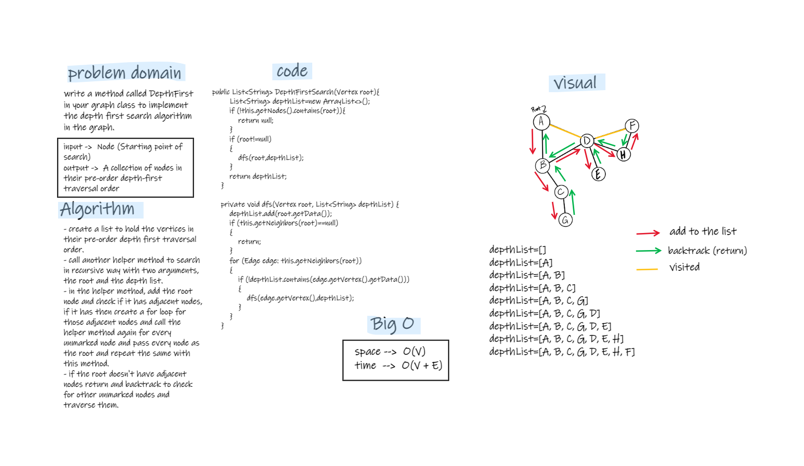

# Depth First Traversal
- Depth-first search is an algorithm for traversing or searching tree or graph data structures.
- This algorithm starts at the root node and explores as far as possible along each branch before backtracking.

## Challenge
- Write the following method for the Graph class:
   - Name: Depth first  
   - Arguments: Node (Starting point of search)
   - Return: A collection of nodes in their pre-order depth-first traversal order
   - Program output: Display the collection

## Approach & Efficiency
- start from the root or any arbitrary node and mark the node and move to the adjacent unmarked node and continue this loop until there is no unmarked adjacent node. Then backtrack and check for other unmarked nodes and traverse them.  
- Finally, print the nodes in the path.  
- The complexity for the time -> O(V + E)
- The complexity for the space -> O(V)

## Solution
