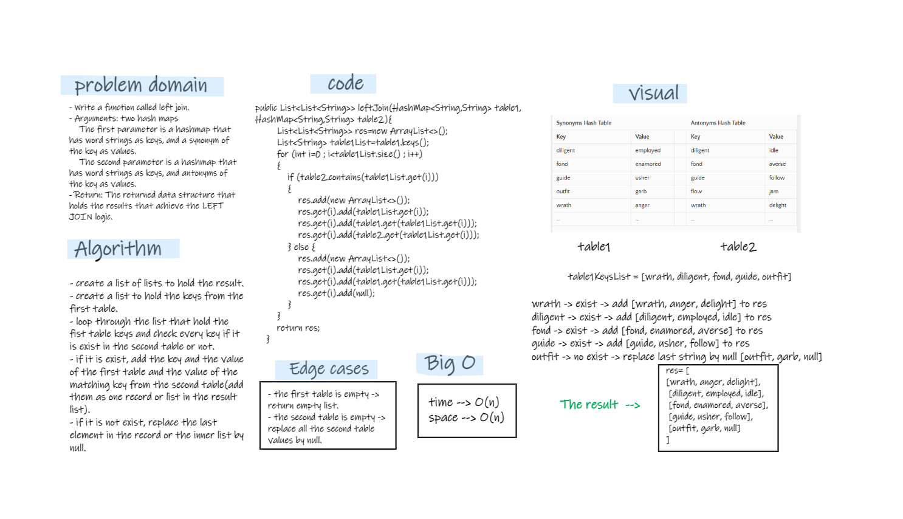

# Hashmap LEFT JOIN
- The LEFT JOIN keyword returns all records from the left table (table1), and the matching records from the right table (table2).  
- For when there is no match, columns are filled with null values.

## Challenge
- Write a function called left join
- Arguments: two hash maps
   - The first parameter is a hashmap that has word strings as keys, and a synonym of the key as values.
   - The second parameter is a hashmap that has word strings as keys, and antonyms of the key as values.
- Return: The returned data structure that holds the results is up to you. It doesn’t need to exactly match the output below, so long as it achieves the LEFT JOIN logic

## Approach & Efficiency
- put the keys of the first table inside a list.
- loop through the list and check every key, if it's exist in the second table or not.
- if it's exist add a list of the key and the value from the first table, and the value of the matching key from the second table.  
- if it's not exist replace the last string in the inner list by null.
- The time complexity --> O(n)
- the space complexity --> O(n)

## Solution
  

