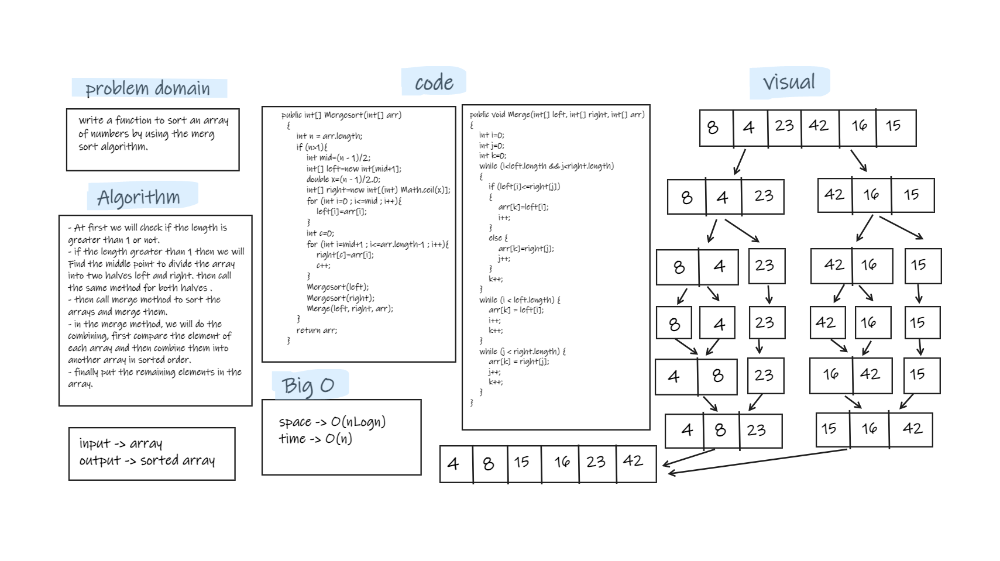

# Challenge Summary
- write a function to sort an array of integer numbers in ascending order using merge sort algorithm.

## Whiteboard Process


## Approach & Efficiency
- It divides the input array into two halves, calls itself for the two halves, and then it merges the two sorted halves. The merge() function is used for merging two halves.  
- the Big O for the merge Algorithm is O(nlogn) for the time, and O(n) for the space.  

## Solution
- testing my code using the unit tests to check if my expected output equal to the actual output. you can run the appTest to check if all the Tests are passed successfully.  
- Also by tracing the code on an array. (like in the whiteboard)   

   ```
  @Test void MergeTest(){
        int[] ar2={8,4,23,42,16,15};
        MergeSort mergeSort=new MergeSort();
        System.out.println(Arrays.toString(mergeSort.Mergesort(ar2)));
        assertEquals("[4, 8, 15, 16, 23, 42]",Arrays.toString(mergeSort.Mergesort(ar2)));
    }
  ```  
- If there is on element in the array.  

  ```
    @Test void MergeOneTest(){
        int[] ar2={8};
        MergeSort mergeSort=new MergeSort();
        System.out.println(Arrays.toString(mergeSort.Mergesort(ar2)));
        assertEquals("[8]",Arrays.toString(mergeSort.Mergesort(ar2)));
    }
  ```  
- If the array is empty.  

  ```
    @Test void MergeEmptyTest(){
        int[] ar2={};
        MergeSort mergeSort=new MergeSort();
        System.out.println(Arrays.toString(mergeSort.Mergesort(ar2)));
        assertEquals("[]",Arrays.toString(mergeSort.Mergesort(ar2)));
    }
  ```
  
