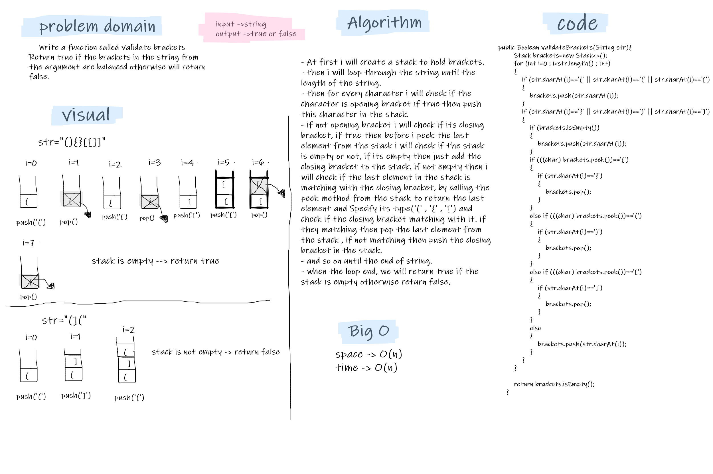

# Challenge Summary
- Write a function called validate brackets Return true if the brackets in the string from the argument are balanced otherwise will return false.

## Whiteboard Process


## Approach & Efficiency
- looping through the string character by character, and if the character is opening bracket i added it to the stack, but if the character is closing bracket i will check if last element in the stack is matching the closing bracket, if matching i will pop the last element in the stack if not i will add the closing bracket to the stack, and so on.  
- the big O is O(n) , because we need to loop through the string.  

## Solution
- tested my code using the unit tests to check if my expected output equal to the actual output. you can run the appTest to check if all the Tests are passed successfully.  
- for true output:  
   ```
    @Test void validateBracketsTrueTest(){
        String str="{}{Code}[Fellows](())";
        ValidateBrackets ob=new ValidateBrackets();
        assertEquals(true,ob.validateBrackets(str));
    }
  ```
- for false output:  
   ```
  @Test void validateBracketsFalse1Test(){
        String str="[({}]";
        ValidateBrackets ob=new ValidateBrackets();
        assertEquals(false,ob.validateBrackets(str));
    }
  ```