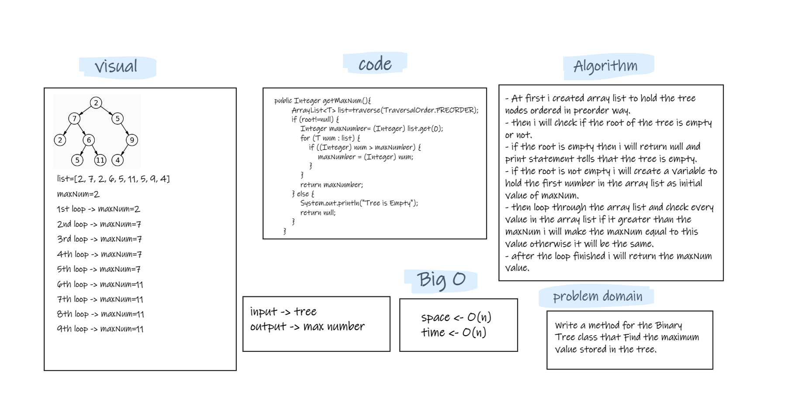

# Challenge Summary
- Write a method for the Binary Tree class that Find the maximum value stored in the tree.

## Whiteboard Process  



## Approach & Efficiency

- i stored the tree nodes in array list ordered in preorder way and find the maximum value in the list.
- the big O is -> O(n) for both time and space.

## Solution

- tested my code using the unit tests to check if my expected output equal to the actual output. you can run the appTest to check if all the Tests are passed successfully.  
- for example : 
   ```
  @Test void maxTreeTest(){
        BinaryTree<Integer> maxTree=new BinaryTree<Integer>();
        BTNode<Integer> node1=new BTNode<Integer>(2);
        maxTree.setRoot(node1);

        node1.setLeftNode(new BTNode<Integer>(7));
        node1.setRightNode(new BTNode<Integer>(5));

        node1.getLeftNode().setLeftNode(new BTNode<Integer>(2));
        node1.getLeftNode().setRightNode(new BTNode<Integer>(6));

        node1.getLeftNode().getRightNode().setLeftNode(new BTNode<Integer>(5));
        node1.getLeftNode().getRightNode().setRightNode(new BTNode<Integer>(11));

        node1.getRightNode().setRightNode(new BTNode<Integer>(9));
        node1.getRightNode().getRightNode().setLeftNode(new BTNode<Integer>(4));

        assertEquals(11,maxTree.getMaxNum());
    }
  ```
- for empty tree:
   ```
  @Test void maxTreeEmptyTest(){
        BinaryTree<Integer> maxTree=new BinaryTree<Integer>();
        assertNull(maxTree.getMaxNum());
    }
  ```
  
- for negative numbers:  
   ```
  @Test void maxTreeNegativeTest(){
        BinaryTree<Integer> maxTree=new BinaryTree<Integer>();
        BTNode<Integer> node1=new BTNode<Integer>(-2);
        maxTree.setRoot(node1);

        node1.setLeftNode(new BTNode<Integer>(-7));
        node1.setRightNode(new BTNode<Integer>(-5));

        node1.getLeftNode().setLeftNode(new BTNode<Integer>(-2));
        node1.getLeftNode().setRightNode(new BTNode<Integer>(-6));

        node1.getLeftNode().getRightNode().setLeftNode(new BTNode<Integer>(-5));
        node1.getLeftNode().getRightNode().setRightNode(new BTNode<Integer>(-11));

        node1.getRightNode().setRightNode(new BTNode<Integer>(-9));
        node1.getRightNode().getRightNode().setLeftNode(new BTNode<Integer>(-4));

        assertEquals(-2,maxTree.getMaxNum());
    }
  ```
- if there is one item in the tree:  
   ```
  @Test void maxTreeOneNumTest(){
        BinaryTree<Integer> maxTree=new BinaryTree<Integer>();
        BTNode<Integer> node1=new BTNode<Integer>(2);
        maxTree.setRoot(node1);
        assertEquals(2,maxTree.getMaxNum());
    }
  ```
  
