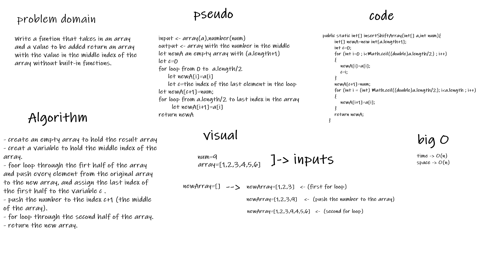

# Insert to Middle of an Array  
Write a function called insertShiftArray which takes in an array and a value to be added. Without utilizing any of the built-in methods available to your language, return an array with the new value added at the middle index.
## Whiteboard Process  
 

## Approach & Efficiency

- creating two small for loops to push the element from the original array to the new one.
- the big O of the problem is O(n) for time and space.