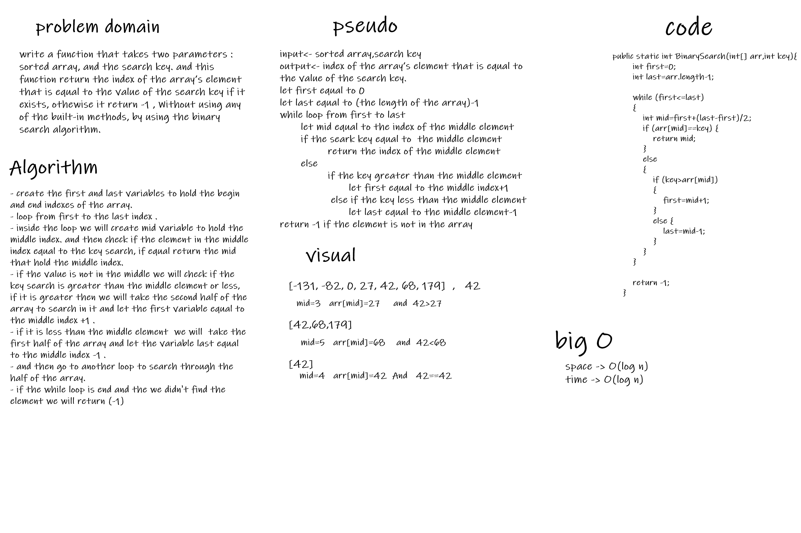

# Binary Search of Sorted Array
write a function that takes two parameters : sorted array, and the search key. and this function return the index of the array’s element that is equal to the value of the search key if it exists, othewise it return -1 , Without using any of the built-in methods, by using the binary search algorithm.

## Whiteboard Process
 

## Approach & Efficiency  

- first we will check if the value in the middle or not if it is in the middle we return the middle index.
- if not we will split the array in two half and check if the value in the first or second half by checking if the value less or greater than the middle element.
- if the value less than the middle element we will search through the first half using the same way .
- and if the value greater than the middle element we will search through the second half using the same way also.
- the big O for this function is O(log n).

