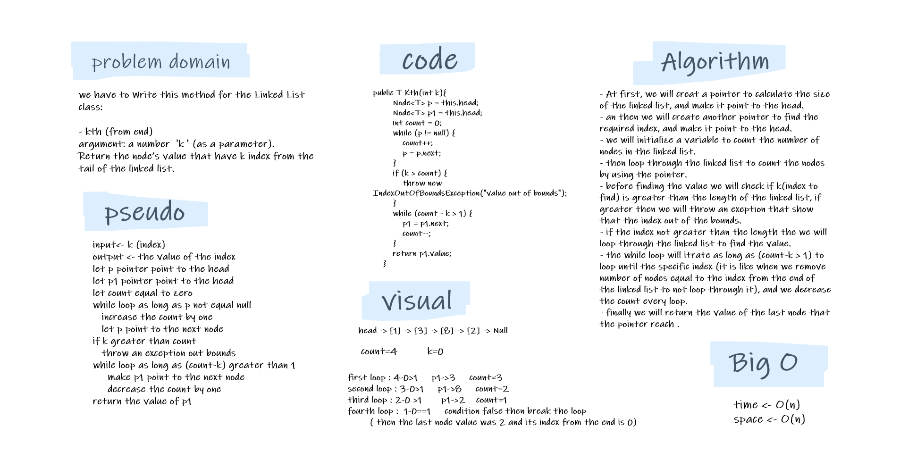

# Challenge Summary

 we have to Write this method for the Linked List class:

-  **kth** (from end)  
  argument: a number 'k' (as a parameter).  
  Return the node’s value that is k places from the tail of the linked list.  

## Whiteboard Process

## Approach & Efficiency

- I calculated the length of the linked list at first, then i abstract the index k from count so when we started loop from the beginning of the linked list we will reach the specific index from the end, and when moving the pointer to the next node every loop we will decrease the count by one.
- for example if we have a linked list of length 5 and the k=1 (the index from the end) we will abstract 5-1=4 , so we will move four times to reach the specific index. and in the next loop will be 4-l=3, and the next one 3-1=2 .... , and so on.
- the big O is O(n).

## Solution

- I wrote tests for every situation for the k. if the k was greater than the length of th linked list, or it was the same value for k and length , or if the k was negative, an if the size of the linked list was 1 .
- in these cases code will throw an exception. otherwise, the code will work correctly.
