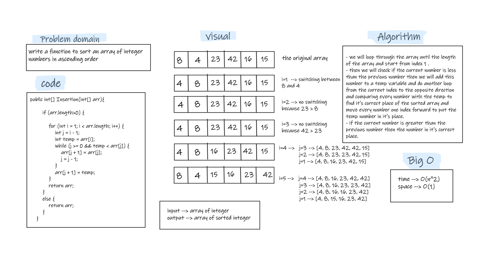

# Challenge Summary
- write a function to sort an array of integer numbers in ascending order.

## Whiteboard Process


## Approach & Efficiency
- stop on every number and check if this is the correct place of it by comparing it with the previous numbers, if it is greater than the previous number then it is the correct place, else if it is less than the previous one then we need to continue comparing the other numbers until we find its correct place that is mean that the previous number is less than it.  
- In the **worst case** : Big O for **time (O(n^2))**, and for **space (O(1))**.
- In the **best case** : Big O for **time (O(n))**, and for **space (O(1))**.

## Solution
- testing my code using the unit tests to check if my expected output equal to the actual output. you can run the appTest to check if all the Tests are passed successfully.  
- Also by tracing the code on an array. (like in the whiteboard) 
   ```
  @Test void InsertionTest(){
        int[] ar={8,4,23,42,16,15};
        InsertionSort sortedArray=new InsertionSort();
        System.out.println(Arrays.toString(sortedArray.Insertion(ar)));
        assertEquals("[4, 8, 15, 16, 23, 42]",Arrays.toString(sortedArray.Insertion(ar)));
    }
  ```
  
