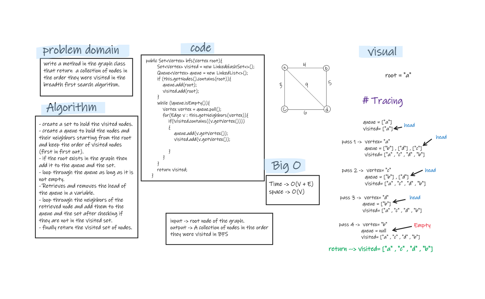

# Challenge Summary
- Write the following method for the Graph class:
   - breadth first
   - Arguments: Node
   - Return: A collection of nodes in the order they were visited.
   - Display the collection


## Whiteboard Process


## Approach & Efficiency
- I used the queue to hold the root node, then remove it from the queue and add its neighbors to the queue, and do the same for every node in the queue. 
- Time complexity -> O(V + E)
- space complexity -> O(V)

## Solution
- testing my code using the unit tests to check if my expected output equal to the actual output. you can run the appTest to check if all the Tests are passed successfully.
- Also, by tracing the code on an array. (like in the whiteboard).

    ```
  @Test void breadthFirstSearchTest(){
        Graph graph=new Graph();
        System.out.println(graph.addVertex("A"));
        System.out.println(graph.addVertex("B"));
        System.out.println(graph.addVertex("C"));
        System.out.println(graph.addVertex("D"));

        graph.addEdges("A","B",4);
        graph.addEdges("A","C",3);
        graph.addEdges("A","D",9);
        graph.addEdges("D","B",5);
        graph.addEdges("C","D",6);

        assertEquals("[Vertex{data='A'}, Vertex{data='B'}, Vertex{data='C'}, Vertex{data='D'}]",graph.bfs(new Vertex("A")).toString());
    }
    @Test void breadthFirstSearchNotExistsNodeTest(){
        Graph graph=new Graph();
        System.out.println(graph.addVertex("A"));
        System.out.println(graph.addVertex("B"));
        System.out.println(graph.addVertex("C"));
        System.out.println(graph.addVertex("D"));

        graph.addEdges("A","B",4);
        graph.addEdges("A","C",3);
        graph.addEdges("A","D",9);
        graph.addEdges("D","B",5);
        graph.addEdges("C","D",6);

        assertEquals("[]",graph.bfs(new Vertex("E")).toString());
    }

    @Test void breadthFirstSearchSingleVertexTest(){
        Graph graph=new Graph();
        System.out.println(graph.addVertex("A"));

        assertEquals("[Vertex{data='A'}]",graph.bfs(new Vertex("A")).toString());
    }
  ```

