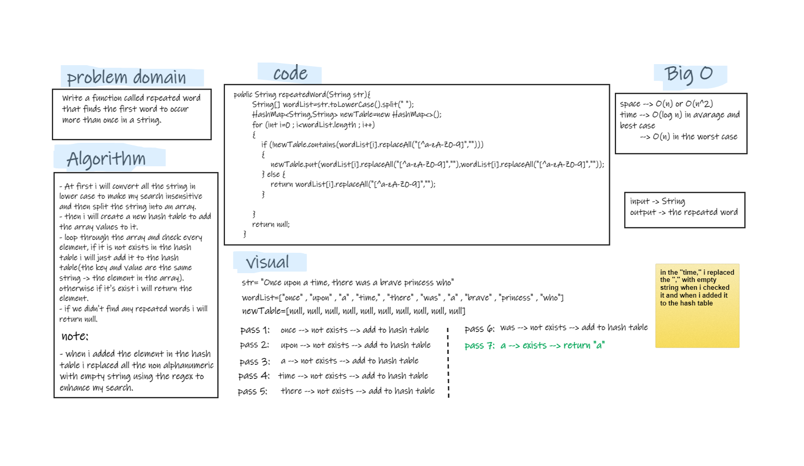

# Challenge Summary
- Write a function called repeated word that finds the first word to occur more than once in a string.  
   - Arguments: string.
   - Return: string (the repeated word).
- Stretch Goals: Modify your function to return a count of each of the words in the provided string.  

## Whiteboard Process


### Stretch Goals
   ```
   public HashMap<String,Integer> wordsCount(String str){
        String[] wordList=str.toLowerCase().split(" ");
        HashMap<String,Integer> newTable=new HashMap<>();
        System.out.println(Arrays.toString(wordList));
        for (int i=0 ; i<wordList.length ; i++)
        {
            if (!newTable.contains(wordList[i].replaceAll("[^a-zA-Z0-9]","")))
            {
                int c=1;
                newTable.put(wordList[i].replaceAll("[^a-zA-Z0-9]",""),c);
            } else {
                int count=newTable.get(wordList[i].replaceAll("[^a-zA-Z0-9]",""));
                newTable.put(wordList[i].replaceAll("[^a-zA-Z0-9]",""),count+1);
            }

        }
        return newTable;
    }
   ```

## Approach & Efficiency
- Approach: split the string into an array of words , then loop through the array and check every element if it is not exists just add it to the hash table, otherwise if it is exists return the word. if there is no repeated words return null.
- Efficiency: 
   - time --> O(log n) for average case, and O(n) for worst case.  
   - space --> O(n^2)
- wordsCount approach: split the string into an array of words , then loop through the array and check every element if it is not exists add it with the value **1** , otherwise if it is exists retrieve the value of the current element and increase it by **1**. finally, return hash table.

## Solution
- testing my code using the unit tests to check if my expected output equal to the actual output. you can run the appTest to check if all the Tests are passed successfully.  
- Also by tracing the code on an array. (like in the whiteboard)

   ```
  @Test void repeatedWordTest(){
        RepeatedWord newString=new RepeatedWord();
        System.out.println("the repeated word: "+newString.repeatedWord("Once upon a time, there was a brave princess who"));

        assertEquals("a",newString.repeatedWord("Once upon a time, there was a brave princess who"));
    }

    @Test void repeatedWordUpperCaseAndLowerCaseMatchTest(){
        RepeatedWord newString=new RepeatedWord();

        assertEquals("it",newString.repeatedWord("It was the best of times, it was the worst of times, it was the age of wisdom, it was the age of foolishness, it was the epoch of belief, it was the epoch of incredulity, it was the season of Light, it was the season of Darkness, it was the spring of hope, it was the winter of despair, we had everything before us, we had nothing before us, we were all going direct to Heaven, we were all going direct the other way – in short, the period was so far like the present period, that some of its noisiest authorities insisted on its being received, for good or for evil, in the superlative degree of comparison only"));
    }

    @Test void repeatedWordRemoveCommasTest(){
        RepeatedWord newString=new RepeatedWord();

        assertEquals("summer",newString.repeatedWord("It was a queer, sultry summer, the summer they electrocuted the Rosenbergs, and I didn’t know what I was doing in New York"));
    }
    @Test void repeatedWordNullTest(){
        RepeatedWord newString=new RepeatedWord();

        assertNull(newString.repeatedWord("Once upon a time, there was brave princess who"));
    }
   ```  
- For wordsCount method :  
   ```
  @Test void wordsCountTest(){
        RepeatedWord newString=new RepeatedWord();

        assertEquals(2,newString.wordsCount("Once upon a time, there was a brave princess who").get("a"));
    }
  ```
