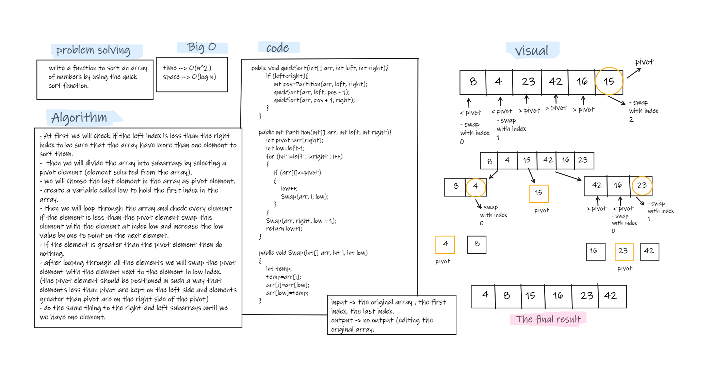

# Challenge Summary
- write a function to sort an array of numbers in ascending order using quick sort algorithm.


## Whiteboard Process


## Approach & Efficiency
- Quick sort is a sorting algorithm uses divide and conquer approach, the array is divided into sub-arrays by selecting a pivot element (element selected from the array).  
- The left and right sub-arrays are also divided using the same approach. This process continues until each sub-array contains a single element. At this point, elements are already sorted. Finally, elements are combined to form a sorted array.  
- Time in the worst case --> O(n^2)  
- space --> O(logn)  

## Solution
- testing my code using the unit tests to check if my expected output equal to the actual output. you can run the appTest to check if all the Tests are passed successfully.  
- Also by tracing the code on an array. (like in the whiteboard)
   ```
  @Test void QuickTest(){
        int[] ar3={8,4,23,42,16,15};
        QuickSort quickSort=new QuickSort();
        quickSort.quickSort(ar3,0,ar3.length-1);
        System.out.println("sorted by quick sort algorithm= "+ Arrays.toString(ar3));
        assertEquals("[4, 8, 15, 16, 23, 42]",Arrays.toString(ar3));
    }
  ```
  
- empty array test:  
   ```
  @Test void QuickEmptyTest(){
        int[] ar3={};
        QuickSort quickSort=new QuickSort();
        quickSort.quickSort(ar3,0,ar3.length-1);
        System.out.println("sorted by quick sort algorithm= "+ Arrays.toString(ar3));
        assertEquals("[]",Arrays.toString(ar3));
    }
  ```
  

