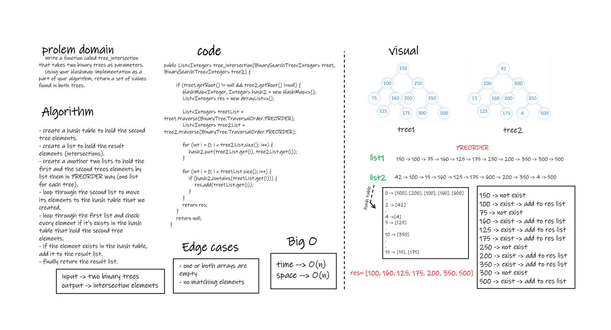

# Challenge Summary
- Write a function called tree_intersection that takes two binary trees as parameters.
- Using your Hashmap implementation as a part of your algorithm, return a set of values found in both trees.


## Whiteboard Process


## Approach & Efficiency
- move the second tree to a hash table, and move the first to a list, and loop through the list and check every element if it's exist in the hash table or not. if it is exists just add it to the result list.
- i used the hash table instead of the list because it will be less complexity than the list, we don't have to loop through the hash table to find the element.  
- time complexity -> O(n)

## Solution
- testing my code using the unit tests to check if my expected output equal to the actual output. you can run the appTest to check if all the Tests are passed successfully.
- Also by tracing the code on an array. (like in the whiteboard)  

   ```
  @Test void treeIntersectionTest(){
        TreeIntersection treeIntersection=new TreeIntersection();
        BinarySearchTree<Integer> tree1=new BinarySearchTree<>();
        BinarySearchTree<Integer> tree2=new BinarySearchTree<>();

        tree1.setRoot(new BTNode<>(150));
        tree1.getRoot().setLeftNode(new BTNode<>(100));
        tree1.getRoot().setRightNode(new BTNode<>(250));

        tree1.getRoot().getLeftNode().setLeftNode(new BTNode<>(75));
        tree1.getRoot().getLeftNode().setRightNode(new BTNode<>(160));

        tree1.getRoot().getRightNode().setLeftNode(new BTNode<>(200));
        tree1.getRoot().getRightNode().setRightNode(new BTNode<>(350));

        tree1.getRoot().getLeftNode().getRightNode().setLeftNode(new BTNode<>(125));
        tree1.getRoot().getLeftNode().getRightNode().setRightNode(new BTNode<>(175));

        tree1.getRoot().getRightNode().getRightNode().setLeftNode(new BTNode<>(300));
        tree1.getRoot().getRightNode().getRightNode().setRightNode(new BTNode<>(500));
        // -------------------------------------  Tree2  -----------------------------------------
        tree2.setRoot(new BTNode<>(42));
        tree2.getRoot().setLeftNode(new BTNode<>(100));
        tree2.getRoot().setRightNode(new BTNode<>(600));

        tree2.getRoot().getLeftNode().setLeftNode(new BTNode<>(15));
        tree2.getRoot().getLeftNode().setRightNode(new BTNode<>(160));

        tree2.getRoot().getRightNode().setLeftNode(new BTNode<>(200));
        tree2.getRoot().getRightNode().setRightNode(new BTNode<>(350));

        tree2.getRoot().getLeftNode().getRightNode().setLeftNode(new BTNode<>(125));
        tree2.getRoot().getLeftNode().getRightNode().setRightNode(new BTNode<>(175));

        tree2.getRoot().getRightNode().getRightNode().setLeftNode(new BTNode<>(4));
        tree2.getRoot().getRightNode().getRightNode().setRightNode(new BTNode<>(500));

        // Test treeIntersection method
        assertEquals("[100, 160, 125, 175, 200, 350, 500]",treeIntersection.tree_intersection(tree1,tree2).toString());
    }
  
    @Test void emptyTreeTest(){
        TreeIntersection treeIntersection=new TreeIntersection();
        BinarySearchTree<Integer> tree1=new BinarySearchTree<>();
        BinarySearchTree<Integer> tree2=new BinarySearchTree<>();

        tree1.setRoot(new BTNode<>(150));
        tree1.getRoot().setLeftNode(new BTNode<>(100));
        tree1.getRoot().setRightNode(new BTNode<>(250));

        tree1.getRoot().getLeftNode().setLeftNode(new BTNode<>(75));
        tree1.getRoot().getLeftNode().setRightNode(new BTNode<>(160));

        tree1.getRoot().getRightNode().setLeftNode(new BTNode<>(200));
        tree1.getRoot().getRightNode().setRightNode(new BTNode<>(350));

        tree1.getRoot().getLeftNode().getRightNode().setLeftNode(new BTNode<>(125));
        tree1.getRoot().getLeftNode().getRightNode().setRightNode(new BTNode<>(175));

        tree1.getRoot().getRightNode().getRightNode().setLeftNode(new BTNode<>(300));
        tree1.getRoot().getRightNode().getRightNode().setRightNode(new BTNode<>(500));

        // Test
        assertNull(treeIntersection.tree_intersection(tree1, tree2));
    }
  
    @Test void noMatchingElementsTest(){
        TreeIntersection treeIntersection=new TreeIntersection();
        BinarySearchTree<Integer> tree3=new BinarySearchTree<>();
        BinarySearchTree<Integer> tree4=new BinarySearchTree<>();

        tree3.setRoot(new BTNode<>(1));
        tree3.getRoot().setLeftNode(new BTNode<>(2));
        tree3.getRoot().setRightNode(new BTNode<>(3));

        tree3.getRoot().getLeftNode().setLeftNode(new BTNode<>(4));
        tree3.getRoot().getLeftNode().setRightNode(new BTNode<>(5));

        tree3.getRoot().getRightNode().setLeftNode(new BTNode<>(6));
        tree3.getRoot().getRightNode().setRightNode(new BTNode<>(7));

        tree3.getRoot().getLeftNode().getRightNode().setLeftNode(new BTNode<>(8));
        tree3.getRoot().getLeftNode().getRightNode().setRightNode(new BTNode<>(9));

        tree3.getRoot().getRightNode().getRightNode().setLeftNode(new BTNode<>(10));
        tree3.getRoot().getRightNode().getRightNode().setRightNode(new BTNode<>(11));
        // -------------------------------------  Tree2  -----------------------------------------
        tree4.setRoot(new BTNode<>(12));
        tree4.getRoot().setLeftNode(new BTNode<>(13));
        tree4.getRoot().setRightNode(new BTNode<>(14));

        tree4.getRoot().getLeftNode().setLeftNode(new BTNode<>(15));
        tree4.getRoot().getLeftNode().setRightNode(new BTNode<>(16));

        tree4.getRoot().getRightNode().setLeftNode(new BTNode<>(17));
        tree4.getRoot().getRightNode().setRightNode(new BTNode<>(18));

        tree4.getRoot().getLeftNode().getRightNode().setLeftNode(new BTNode<>(19));
        tree4.getRoot().getLeftNode().getRightNode().setRightNode(new BTNode<>(20));

        tree4.getRoot().getRightNode().getRightNode().setLeftNode(new BTNode<>(21));
        tree4.getRoot().getRightNode().getRightNode().setRightNode(new BTNode<>(22));

        // Test
        assertEquals("[]",treeIntersection.tree_intersection(tree3,tree4).toString());
    }
  ```

